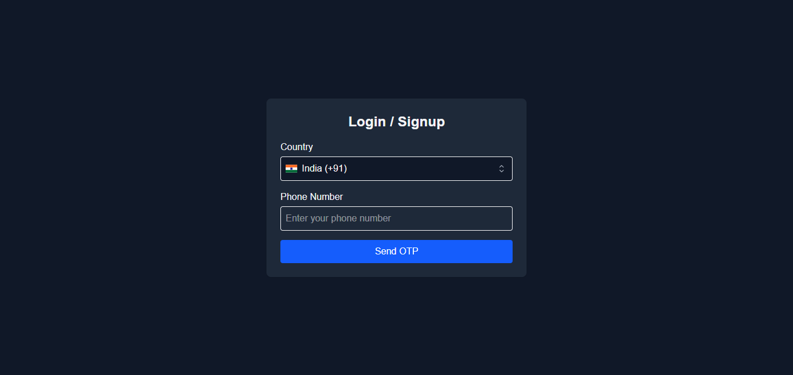
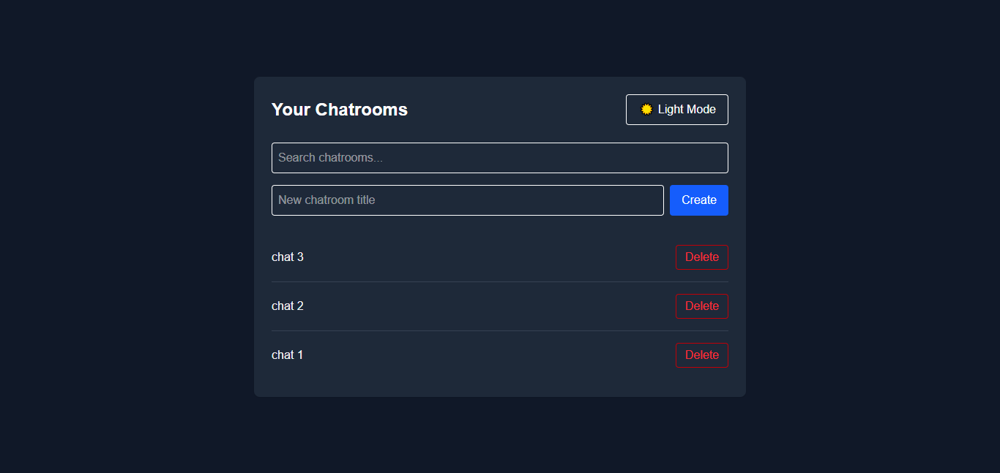
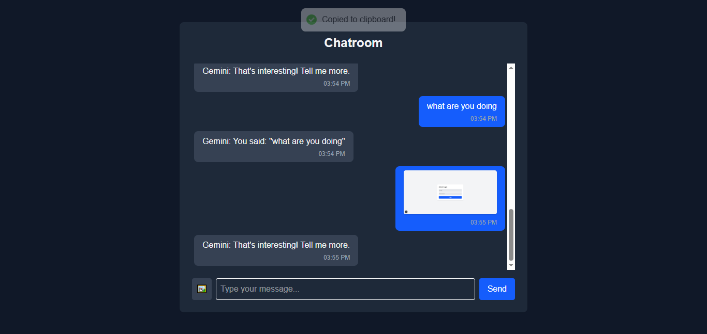

# AI Chat App

A modern chat application built with Next.js, React, Redux Toolkit, and Tailwind CSS. Features include:

- User authentication (login/OTP)
- Multiple chatrooms with persistent storage
- AI-powered chat simulation
- Dashboard with local dark mode toggle
- Responsive and accessible UI

## Features

- **Authentication:** Secure login and OTP verification flow.
- **Chatrooms:** Create, search, and delete chatrooms. Each chatroom supports AI/user messaging and image uploads.
- **Dashboard:** Manage your chatrooms with a local dark mode toggle (affects dashboard only).
- **State Management:** Uses Redux Toolkit for predictable state management.
- **Persistence:** Chatrooms are saved in localStorage for session persistence.
- **Styling:** Built with Tailwind CSS and supports both light and dark themes (dashboard only).

## Getting Started

1. **Install dependencies:**
   ```bash
   npm install
   # or
   yarn install
   ```

2. **Run the development server:**
   ```bash
   npm run dev
   # or
   yarn dev
   ```

3. **Open your browser:**
   Visit [http://localhost:3000](http://localhost:3000)

## Login & OTP Instructions

To access the dashboard:

1. On the login page, **select a country** from the dropdown.
2. **Enter any 10-digit phone number** (e.g., 1234567890).
3. Submit to receive the OTP prompt.
4. **Enter `123456` as the OTP** to complete authentication.
5. You will be redirected to the dashboard upon successful verification.

## Deployment

The app is live at: [https://ai-chat-app-w0y8.onrender.com](https://ai-chat-app-w0y8.onrender.com)

## Folder & Component Structure

- `src/app/` — Next.js app directory (routes, layouts, providers)
  - `(auth)/` — Authentication pages (login, OTP)
  - `(dashboard)/` — Dashboard page
  - `(chatroom)/` — Chatroom pages
- `src/features/` — Redux slices for auth, chatrooms, and messages
- `src/store/` — Redux store configuration
- `src/components/` — Reusable UI components (e.g., CountrySelector)
- `src/lib/` — Utility functions and API helpers
- `src/styles/` — Tailwind CSS configuration and global styles

## Implementation Details

### Throttling
- **Search in Dashboard:** The chatroom search input uses a debounced effect (`setTimeout` in a `useEffect`) to throttle filtering, reducing unnecessary renders and improving performance.

### Pagination & Infinite Scroll
- **Chatroom Messages:** Messages in a chatroom are paginated. The UI displays the latest messages and allows loading older messages in batches (pagination). Infinite scroll is simulated by a "Load older messages" button, which prepends older messages to the list.

### Form Validation
- **Login, OTP, and Chatroom Creation:** All forms use [React Hook Form](https://react-hook-form.com/) with [Zod](https://zod.dev/) for schema-based validation. Errors are displayed inline for a smooth user experience.

## Screenshots




## Project Structure

- `src/app/` — Next.js app directory (pages, layouts, providers)
- `src/features/` — Redux slices for auth, chatrooms, and messages
- `src/store/` — Redux store configuration
- `src/components/` — Reusable UI components
- `src/styles/` — Tailwind CSS configuration

## Customization

- **Dark Mode:** The dashboard page supports a local dark mode toggle. Other pages remain in light mode.
- **State:** All state is managed via Redux Toolkit. You can extend slices in `src/features/` as needed.

## License

This project is open source and available under the [MIT License](LICENSE).
